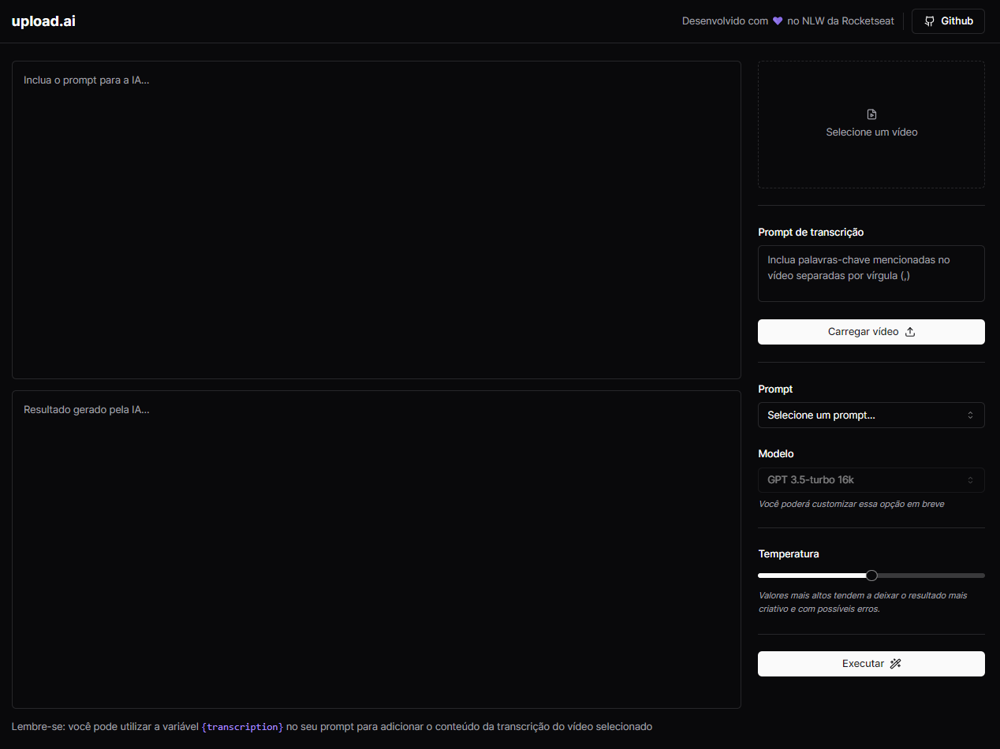

<h1 align="center">🚀NLW AI - Mastery🚀</h1>

 

Este projeto foi desenvolvido pela Rocketseat durante a Next Level Week (NLW) - AI da trilha Mastery.

 

<h2>👩‍💻 Tecnologias</h2>

<h3>Front-end</h3>
  

  
<h3>Back-end</h3>

 

<h2>📱 Projeto</h2>

O Projeto consiste em fazer o upload de um vídeo e com a ajuda da Inteligência Artificial, gerar o áudio a partir do vídeo, transcrever o áudio em texto e criar títulos e descrição para o vídeo para o YouTube.

Aplicação full-stack front-end e back-end.

